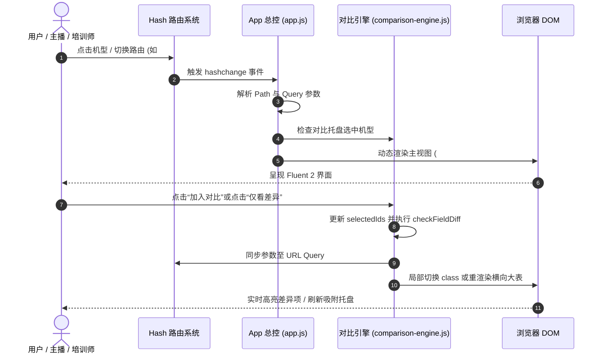

# Microsoft Surface Specs Hub - 系统架构与技术实现白皮书 (Technical Architecture)

本文档归档 **Microsoft Surface 全系产品参数中心**（HubWeb.cn 极致复刻版）的完整技术架构、组件分层、数据流图、状态机机制及离线自给自足设计。

---

## 1. 架构目标与核心原则

1. **纯静态零依赖离线可用 (100% Offline-First)**：
   - 彻底摆脱 Node.js 运行时服务、后端数据库或外部 CDN（如 unpkg, cdnjs, Google Fonts）。
   - 双击根目录 `index.html` 或使用任何静态 Web 服务器（Nginx / GitHub Pages / Cloudflare Pages / OSS）均可零配置毫秒级秒开。
2. **极高信息密度 (High Information Density)**：
   - 严格继承 HubWeb.cn 专业参数工具属性，拒绝冗余空洞的营销大图，单屏可查阅最多有效技术规格。
3. **双轴粘性吸附大表 (Dual-Axis Sticky Spec Table)**：
   - 解决桌面端 1920px / 1440px 与移动端 390px 横向超长滚动的定位难题。行首列吸附左侧、表头吸附顶部（带有 48px Header 偏移补偿），支持 Shift + 滚轮横向漫游。
4. **零脑补数据治理 (Zero-Hallucination Specification Model)**：
   - 严格区分“确定有效数据”、“官方未披露（NOT_DISCLOSED）”、“形态不适用（NOT_APPLICABLE）”和“暂缺”，所有字段可追溯数据来源与可信度等级。

---

## 2. 总体架构设计 (System Architecture Diagram)

```mermaid
graph TD
    subgraph UI_Layer [表现层 Presentation & Fluent 2 UI]
        Header[顶部 Fluent 导航栏 / 搜索 / 主题切换]
        Sidebar[左侧分类树 HubWeb 结构]
        MainView[中央主工作台容器 #hub-main-content]
        SpecTable[双轴粘性参数大表 .spec-table]
        ScreenCalc[3:2 屏幕对比器]
        ChipLadder[NPU TOPS 算力天梯图]
        AccessoryMatrix[双向配件兼容矩阵]
        CompareDock[底部常驻对比吸附托盘 #comparison-dock]
    end

    subgraph Controller_Layer [应用控制器与路由层 Master Controller]
        AppCtrl[App 控制器 (app.js)]
        HashRouter[Hash 路由解析器 (#/ · #/surface/:id · #/compare · #/timeline · #/tools/*)]
        FilterEngine[多维联动筛选器 (CPU · 状态 · Copilot+ · 受众)]
        SearchEngine[全局模糊索引检索引擎]
        StorageMgr[本地状态持久化 (localStorage)]
    end

    subgraph Engine_Layer [核心业务逻辑引擎 Core Engines]
        CompEngine[对比引擎 (comparison-engine.js)]
        ToolsEngine[辅助计算引擎 (tools-engine.js)]
        DiffChecker[字段智能比对算法 (checkFieldDiff)]
        GeomCalc[3:2 屏幕几何算法 (calculateDimensions)]
    end

    subgraph Data_Layer [数据中枢 Master Data Store (surface-data.js)]
        Categories[8 大产品品类谱系]
        Devices[42 款 Surface 历代全系机型档案]
        SpecGroups[13 大专属参数标准分组]
        Chips[12 款核心处理器与 NPU 架构库]
        Accessories[3 大类双向配件兼容矩阵]
    end

    Data_Layer --> CompEngine
    Data_Layer --> ToolsEngine
    Data_Layer --> FilterEngine
    Data_Layer --> SearchEngine

    CompEngine --> SpecTable
    CompEngine --> CompareDock
    ToolsEngine --> ScreenCalc
    ToolsEngine --> ChipLadder
    ToolsEngine --> AccessoryMatrix

    HashRouter --> AppCtrl
    FilterEngine --> MainView
    SearchEngine --> Header
    StorageMgr <--> CompEngine
    AppCtrl --> MainView
```

---

## 3. 核心模块分层职责

### 3.1 数据存储层 (`js/surface-data.js`)
- **8 大品类**：Pro、Laptop、Laptop Studio、Book、Go、Laptop Go、Studio/Hub、Duo。
- **42 款全系机型**：收录 2012 初代至 2026 最新代全部旗舰与主流版本。
- **13 大专属参数分组**：
  1. `basic`：基础与外观
  2. `processor`：处理器与 AI 算力（含 NPU TOPS 与 Copilot+ PC 认证）
  3. `memory_storage`：内存与存储（含免工具快拆 SSD 标注）
  4. `display`：PixelSense 触控显示屏（含 3:2 比例与动态高刷）
  5. `camera`：摄像头与视讯（含 Studio 特效支持）
  6. `audio`：音频与扬声器
  7. `connectivity`：连接与端口（雷电4/USB4/磁吸接口）
  8. `power`：电池与电源管理（Wh 容量与充电功率）
  9. `input`：输入设备与手写生态（Slim Pen 2 触觉震动与 Flex 离机键盘）
  10. `security`：安全性与企业管理（TPM / Pluton / Secured-core PC）
  11. `design`：机身尺寸与重量（长宽厚、克重与整机重量）
  12. `service`：可维修性与售后（官方备件与 iFixit 评级）
  13. `metadata`：资料与价格来源（首发指导价与核验日期）
- **12 款处理器架构库**：高通骁龙 X2、X Elite、X Plus、Lunar Lake 268V、AMD Ryzen AI 9、Meteor Lake 165H/U、SQ3、SQ1/2、Tiger Lake、Alder Lake、N200。
- **双向配件兼容库**：Flex 键盘、特制版键盘盖、Slim Pen 2。

### 3.2 对比核心引擎 (`js/comparison-engine.js`)
- **差异比对算法 (`checkFieldDiff`)**：遍历参与比对的机型列表，进行深层值比对。同值判定为 `row-same`，异值判定为 `row-diff`。
- **视图过滤模式**：
  - 常规全量视图。
  - 差异高亮视图（`.highlight-diff`，异值行赋予淡蓝高亮背景）。
  - 仅看差异视图（`.diff-only`，利用纯 CSS 折叠隐藏所有 `row-same` 相同行，零 DOM 重排重绘）。
- **列顺序动态对调 (`swapDeviceOrder`)**：支持用户在表头点击 `◀` 或 `▶`，瞬间互换两列机型，实时重新映射参数单元格。
- **对比托盘与持久化**：管理最多 5 款设备的临时对比池，与 `localStorage` 同步，在页面刷新或跨路由跳转时不丢失。

### 3.3 辅助工具引擎 (`js/tools-engine.js`)
- **3:2 屏幕对比器 (`renderScreenCalculator` & `calculateDimensions`)**：
  - 基于三角几何学精确推导对角线尺寸、水平宽度、垂直高度与物理面积：
    $$\theta = \arctan(H_{ratio} / W_{ratio})$$
    $$W = \text{diag} \cdot \cos\theta, \quad H = \text{diag} \cdot \sin\theta, \quad \text{Area} = W \cdot H$$
  - 计算 3:2 相比 16:9 / 16:10 多出的纵向可视高度与表格多显行数，生成同比例等高线框图。
- **处理器与 NPU TOPS 天梯榜 (`renderChipLadder`)**：
  - 柱状横向条形天梯图，严格以 40 TOPS 绘制 Copilot+ PC 准入红线。
- **双向配件查询矩阵 (`renderAccessoryMatrix`)**：
  - 支持“全景兼容矩阵大表”、“按配件查适用机型”、“按机型查可用配件”三重视角。

### 3.4 应用总控与路由 (`js/app.js`)
- **Hash 路由分发器**：
  - `#/`：产品中心大厅与全系推荐卡片
  - `#/surface/:series`：系列产品横向大表对比页
  - `#/surface/:series/:id`：单款设备深度规格详情页
  - `#/compare?products=...`：独立、带参、可直接分享的对比页
  - `#/timeline`：2012 ~ 2026 编年历史时间线
  - `#/tools/screen`：3:2 屏幕对比计算器
  - `#/tools/chips`：NPU TOPS 算力天梯图
  - `#/tools/compat`：双向配件兼容性矩阵
- **多维筛选联动**：处理器架构（全部/高通/Intel/AMD）、销售状态（国行在售/历史归档）、Copilot+ PC（≥40 TOPS）与面向群体，状态双向同步至 URL Query 参数。
- **全局秒级搜索**：基于设备名称、代际、处理器、NPU TOPS、宣传语的多字段全文实时模糊过滤。

---

## 4. 数据流与状态机机制



---

## 5. 设计系统令牌与无障碍体系 (`fluent-tokens.css`)

- **色彩体系**：
  - 微软品牌蓝：`--ms-accent: #0078d4;`
  - 亚克力 / Mica 磨砂材质：`--ms-bg-header: rgba(255, 255, 255, 0.85); backdrop-filter: blur(20px);`
  - 差异高亮色：`--ms-highlight-diff: rgba(0, 120, 212, 0.08);`
- **排版字体**：
  - Windows 首选字体族：`'Segoe UI Variable', 'Segoe UI', -apple-system, BlinkMacSystemFont, Roboto, 'PingFang SC', 'Microsoft YaHei', sans-serif;`
- **深色模式 (Dark Theme)**：
  - 纯 CSS `[data-theme="dark"]` 变量替换，无任何外部库介入。
  - 所有正文与背景对比度经测试均满足 **WCAG 2.2 AA 标准（> 4.5:1）**。

---

## 6. 部署与上线指南

由于本工程为 100% 静态纯 HTML/CSS/JS 交付，部署极度轻量：

1. **直接双击秒开**：
   - 将 `surface-specs-hub/` 目录拷贝至任何 U 盘或本地电脑，双击 `index.html` 即可完整使用全部功能。
2. **静态托管（Nginx 示例）**：
   ```nginx
   server {
       listen 80;
       server_name specs.surface.local;
       root /var/www/surface-specs-hub;
       index index.html;

       location / {
           try_files $uri $uri/ /index.html;
       }
   }
   ```
3. **一键上传云端**：
   - 可直接推送到 GitHub Pages、Vercel、Netlify 或 Cloudflare Pages，构建命令留空（直接托管根目录）。
